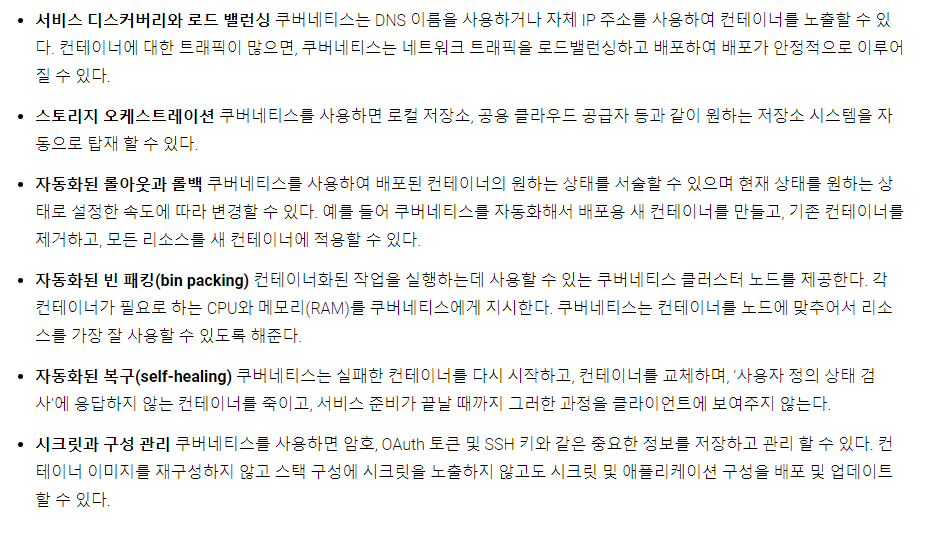

# 1. Kubernetes

 - Container Orchestration FrameWork(컨테이너 오케스트레이션 프레임워크)
 - 컨테이너를 쉽고 빠르게 배포/확장하고 관리를 자동화해주는 오픈소스 플랫폼
 - 단순한 컨테이너 플랫폼이 아닌 **마이크로서비스**, 클라우드 플랫폼을 지향하고 <u>**컨테이너로 이루어진 것들을 손쉽게 담고 관리할 수 있는 그릇 역할**</u>을 합니다. 서버리스, CI/CD, 머신러닝 등 다양한 기능이 쿠버네티스 플랫폼 위에서 동작한다.
 - 쿠버네티스는 전통적인, 모든 것이 포함된 Platform as a Service(PaaS)가 아니다.

 ## 1.1 Container Orchestration(컨테이너 오케스트레이션) 이란

 - 1.1.1 컨테이너 오케스트레이션이 하는 일
    - 여러 개의 서버에 컨테이너를 배포하고 운영하면서 <u>1)서비스 디스커버리</u>같은 기능을 이용해 서비스 간 연결을 쉽게 해주는 것이다.
    - 각 서버마다 ap01, db01, cache01, 같은 이름을 지어 각각 접속하여 관리하는 것이 아닌 서버를 하나로 묶어 적당한 서버를 자동으로 선택해 어플리케이션을 배포하고 부하가 발생 시 컨테이너를 늘리고 일부 서버에 장애가 발생하면 정상 동작 중인 서버에 다시 띄워 장애를 방지한다.

## 1.2 다양한 형식의 배포방식

 1. Deployment - 새로운 버전의 어플리케이션을 다양한 전략으로 무중단 배포가 가능
 1. StatefulSets - 실행순서를 보장하고 호스트 이름과 볼륨을 일정하게 사용할 수 있어 순서나 데이터가 중요한 경우 사용
 1. DaemonSet - 로그, 모니터링 등 모든 노드에 설치가 필요한 경우
 1. Job, CronJob - 배치성 작업

## 1.3 필요이유

 - 프로덕션 환경에서는 어플리케이션을 실행하는 컨테이너를 관리하고 가동 중지시간이 없는지 확인해야 한다. 예로 컨테이너가 다운되면 다른 컨테이너를 다시 시작해야한다. 해당 문제를 시스템에 의해 처리하기위해 필요.

 - 쿠버네티스는 분산 시스템을 탄력적으로 실행하기 위한 프레임 워크를 제공한다. 어플리케이션의 확장과 장애 조치를 처리하고, 배포 패턴등을 제공.

## 1.4 제공 기능

-----
1\) Service discovery - 서비스 클라이언트가 서비스를 호출할 때 서비스의 위치(IP주소 와 Port)를 알아 낼수 있는 기능

 ## 출처

  - 쿠버네티스란 - https://kubernetes.io/ko/docs/concepts/overview/what-is-kubernetes/
  - What is Kubernetes? - https://www.popit.kr/kubernetes-introduction/
  - Service discovery - https://bcho.tistory.com/1252

 ## 참고

  - 쿠버네티스 공식 사이트 - https://kubernetes.io/ko/